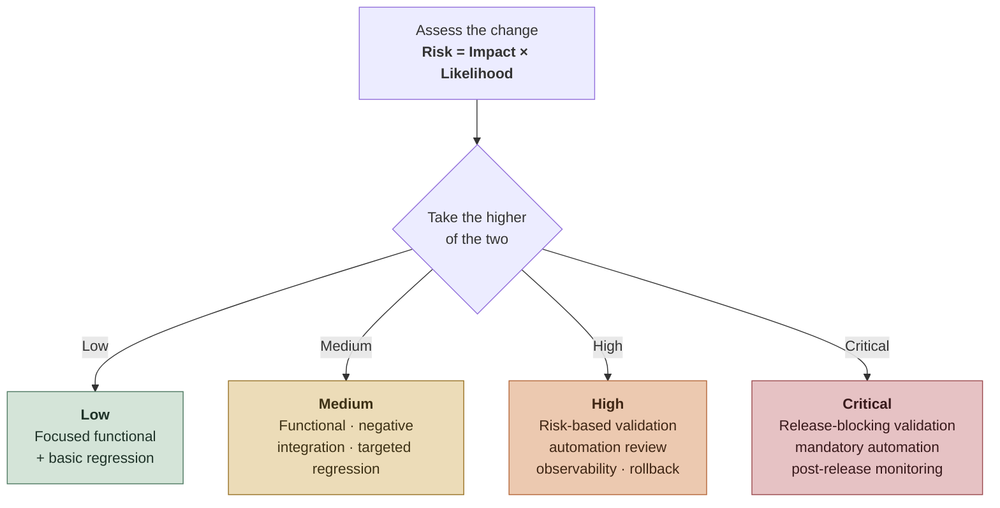

# 01 - Before Development

Quality planning and risk prevention before coding starts.

The goal: **make the work clear, testable, valuable, and safe to build**. Involve QA early enough to expose ambiguity and risk, align on user value, and define how the change will be validated before code is written.

> **Key idea:** A story is not ready just because it has a description. It is ready when the team understands value, risk, contracts, testability, and expected evidence.

## On this page

1. [Start with user value](#1-start-with-user-value)
2. [Run a lightweight Three Amigos review](#2-run-a-lightweight-three-amigos-review)
3. [Write acceptance criteria that are testable](#3-write-acceptance-criteria-that-are-testable)
4. [Map risk before defining test depth](#4-map-risk-before-defining-test-depth)
5. [Create the test strategy and draft test cases early](#5-create-the-test-strategy-and-draft-test-cases-early)
6. [Validate testability before implementation](#6-validate-testability-before-implementation)
7. [Treat contracts as quality assets](#7-treat-contracts-as-quality-assets)
8. [Separate frontend/UX and backend/API strategies](#8-separate-frontendux-and-backendapi-strategies)
9. [Choose tools, languages, and frameworks intentionally](#9-choose-tools-languages-and-frameworks-intentionally)
10. [Prepare test data and environments early](#10-prepare-test-data-and-environments-early)
11. [Assess QA maturity when joining a team](#11-assess-qa-maturity-when-joining-a-team)
12. [Build QA community through a QA Guild](#12-build-qa-community-through-a-qa-guild)
13. [Definition of Ready](#13-definition-of-ready)

Companion reference: [Quality Review Checklist - Before development](resources/quality-review-checklist.md#before-development).

## Outcomes expected before coding starts

By the end of this phase, the team can explain what to build and why, what could fail, how success and failure will be validated, and what must be observable after release — captured formally in the [Definition of Ready](#13-definition-of-ready).

## 1. Start with user value

Quality starts with the real user journey, not only the technical change.

### Questions to ask

- Who consumes this change — user, customer, support team, or system?
- What problem are we solving, and what task must they complete?
- What could frustrate, block, confuse, or mislead them?
- What would make it feel reliable and easy to use?
- How will we know the experience improved?

> **Principle:** A feature can be technically correct and still fail if the user journey is unclear, slow, confusing, or hard to recover from.

## 2. Run a lightweight Three Amigos review

Hold a short **Product + Development + QA** conversation before implementation.

> **Real world:** a formal Three Amigos is rare, and QA is often pulled in late. If that is your situation, start small — ask one or two of the questions below in refinement, or directly to the developer. Influence beats ceremony.

### Questions to answer

- What is the expected happy path?
- What are the most important negative paths and likely edge cases?
- What should never break?
- How will we validate this across Dev, Staging, and Production?
- What logs, metrics, or traces will help troubleshoot it later?

### Output

A story should leave refinement with clear acceptance criteria, known risks, test data needs, dependencies, and a shared definition of done.

## 3. Write acceptance criteria that are testable

Good acceptance criteria are specific, observable, and tied to behavior.

### Strong acceptance criteria include

- expected behavior;
- user or system action;
- input data;
- output/result;
- error handling;
- permission or role rules;
- integration or contract expectations;
- audit/logging expectations when relevant.

### Option A - BDD format

Use when behavior needs to be business-readable across Product, Dev, and QA.

```gherkin
Given a valid user or system context
When the action is performed
Then the expected result should happen
And the system should provide clear feedback or traceability
```

### Option B - Practical checklist format

Use when the team needs a faster, simpler format.

```text
- User can complete [main action] when [condition]
- System prevents [invalid action] when [condition]
- Error message explains [problem] and [next step]
- Existing behavior [flow/component] is not impacted
- Logs include [ID/context] for troubleshooting
```

### Weak vs strong, in practice

> **Weak:** "Login works."
> **Strong:** "Given an invalid password, login is rejected, the user sees error X, and the attempt is logged with a correlation ID."

The strong version names the condition, the observable result, and the troubleshooting signal, so it is testable without guessing.

### Add quality criteria, not only functional criteria

Cover failure and operability, not just the happy path:

- Invalid data fails explicitly, not silently.
- Errors are clear, actionable, and logged with a correlation ID.
- The API response keeps backward compatibility.
- Critical flows are covered by automated regression when valuable.

## 4. Map risk before defining test depth

Testing depth should follow risk; not every change deserves the same effort.

> **Shortcut:** Risk = Impact × Likelihood. Score both High/Medium/Low, take the higher of the two, and let that drive the risk level and testing depth.



For full risk assessment, use the [Test Strategy Template](templates/test-strategy-template.md).

### Risk factors to review

- **User impact:** Could this block a critical user journey?
- **Business impact:** Could this affect revenue, compliance, safety, or trust?
- **Technical complexity:** Does it involve integrations, async flows, data transformation, permissions, or configuration?
- **Change size:** Is the change touching shared components or legacy areas?
- **Defect history:** Has this area failed before?
- **Observability:** Can failures be detected and diagnosed quickly?

### Risk levels

| Risk level | Typical testing depth |
|---|---|
| Low | Focused functional validation and basic regression. |
| Medium | Functional, negative, integration, and targeted regression. |
| High | Full risk-based validation, automation review, observability checks, rollback awareness, and release follow-up. |
| Critical | Release-blocking validation: full risk-based coverage, mandatory automated regression, observability and rollback verification, and post-release monitoring. |

> **Data point:** ~80% of avoidable rework traces to ~20% of defects, and projects spend 40–50% of effort on avoidable rework (Boehm & Basili, 2001). Testing the risky few beats testing everything evenly — that is the case for risk-based depth.

## 5. Create the test strategy and draft test cases early

For medium or high-risk work, start the **test strategy and test cases before development**, not after handoff.

### What to define early

- Scope and out-of-scope areas
- Main risks and mitigation
- Test levels: unit, API, integration, UI, regression, exploratory, UAT
- Manual vs automated validation
- Test data and environment needs
- Frontend/UX and backend/API validation approach
- Evidence expected for sign-off
- Post-deploy checks when needed

Use the [Test Strategy Template](templates/test-strategy-template.md) and [Test Cases Template](templates/test-cases-template.md) to define risks, scope, validation approach, and early scenarios.

### Why this helps

- Developers see expected validations before implementation.
- Missing requirements and automation candidates surface earlier.
- QA execution becomes faster and less reactive.

### AI-assisted option

AI agents, skills, and instructions can speed up strategy and test-case drafting, with human review. See [AI Tools](ai-tools/README.md).

Useful prompts:

```text
Review this story for ambiguity, risk, missing acceptance criteria, and testability gaps.
```

```text
Create a lightweight test strategy and risk-based test case outline for this feature.
```

Human QA still owns final judgment, expected results, risk priority, and product context.

## 6. Validate testability before implementation

A feature is easier to test when testability is designed in.

### Testability questions

- Can this be tested independently?
- Can we prepare reliable test data?
- Can we mock or simulate external dependencies?
- Can we validate the result through API, database, logs, UI, files, or events?
- Can failures be reproduced, and can the team identify which step failed?
- Do we need feature flags, test hooks, or better logs?

If the answer is unclear, the story needs more design discussion before development starts.

## 7. Treat contracts as quality assets

For APIs, files, events, schemas, data mappings, or integrations, the contract is part of the product.

### A good contract defines

- version;
- required and optional fields;
- data types and formats;
- default and allowed values;
- backward compatibility expectations;
- sample valid and invalid payloads;
- error responses;
- ownership and change process.

QA should review contracts with the same seriousness as UI behavior.

## 8. Separate frontend/UX and backend/API strategies

Frontend and backend testing protect different risks. A strong strategy covers both without overusing one layer.

### Frontend / UX focus

Validate the user journey, usability, accessibility, clarity, visual feedback, error recovery, permissions, and state changes.

Useful validation:

- exploratory testing;
- UI and accessibility checks;
- usability review;
- critical UI automation;
- copy, labels, empty states, errors, loading states, and recovery paths.

Use usability heuristics to support structured review. Reference: [Nielsen Heuristics Workshop](https://youtu.be/OtyM8dGKLUU?si=Fu3HYPjSQG3NDAoG)

### Backend / API focus

Validate business rules, contracts, data integrity, security, performance, integrations, error handling, and system behavior beyond the UI.

Useful validation:

- API, contract, and integration tests;
- logs and correlation IDs;
- data validation;
- negative testing;
- authorization checks;
- duplicate requests, timeouts, retries, and idempotency when relevant.

## 9. Choose tools, languages, and frameworks intentionally

Tooling should match the product, risk, team skills, architecture, and maintenance cost.

### Questions before choosing tools

- Is the product mainly UI, API, data, mobile, backend, integration, or hybrid?
- Which layer gives the fastest reliable feedback?
- What does the team already know and maintain well?
- Will this tool work in CI/CD and local development?
- Does it support the required reporting, debugging, retries, and test data strategy?
- Is it stable for the application architecture?

> **Principle:** The best tool is not the trendiest one. It is the one the team can use reliably to protect critical behavior over time.

## 10. Prepare test data and environments early

Late test data is a common reason for blocked QA.

### Plan ahead

- Required users, roles, permissions, and accounts
- Valid and invalid input data, plus boundary values
- Existing records needed for regression
- External system availability
- Files, payloads, or events needed for integrations
- Data cleanup strategy

### Good practice

Keep a small, reusable set of **golden test data** for critical flows.

> **Note:** Sections 11 and 12 are team-level practices that run over weeks and months, not per-story checks. Use them when joining a team or building quality culture.

## 11. Assess QA maturity when joining a team

When QA joins a new team, understand how quality currently works before proposing changes.

### Run a simple team survey

Measure the current state of:

- requirement quality;
- Definition of Ready and Definition of Done;
- test strategy and coverage;
- automation health;
- environment and test data stability;
- defect management;
- observability;
- release confidence;
- user focus and quality culture.

Repeat the survey after a few sprints or months to show improvement, gaps, and culture change.

For a reusable model, see [QA Assessment Survey Template](templates/qa-assessment-survey-template.md).

## 12. Build QA community through a QA Guild

A QA Guild is a recurring space where QAs from different teams share knowledge, patterns, failures, tools, and standards.

### Useful guild topics

- testing techniques and automation patterns;
- flaky tests;
- accessibility and UX testing;
- API and contract testing;
- AI-assisted QA;
- quality metrics;
- incident learnings;
- framework/tool decisions.

> **Principle:** QA maturity grows faster when knowledge is shared across teams instead of staying isolated inside one squad.

## 13. Definition of Ready

A story is ready for development when:

- the goal and value are clear;
- acceptance criteria are testable;
- main risks and dependencies are identified;
- test data needs are understood;
- UX/API/contract expectations are documented;
- frontend and backend validation needs are understood;
- non-functional expectations are clear when relevant;
- observability needs are defined for risky flows;
- QA, Dev, and Product share the same understanding.

For a full template, see [Definition of Ready & Definition of Done Template](templates/definition-of-ready-done-template.md).

## Before development checklist

- [ ] User/business value is clear.
- [ ] User journey and expected experience are understood.
- [ ] Acceptance criteria are testable.
- [ ] BDD or practical checklist format was chosen.
- [ ] Happy path and negative paths are known.
- [ ] Risks are classified.
- [ ] Test strategy and test case outline started when relevant.
- [ ] Test data needs are identified.
- [ ] Dependencies are visible.
- [ ] Integration/API/data contracts are documented.
- [ ] Frontend/UX and backend/API strategies are considered.
- [ ] Tool/framework choices are aligned with product risk and team context.
- [ ] Observability needs are considered.
- [ ] Definition of Ready is met.

## Key message

> QA does not need to wait for code to create value.  
> The earlier QA exposes ambiguity, user risk, and testability gaps, the cheaper and safer the delivery becomes.

---

**Playbook:** **01 - Before Development** · [02 - During Development →](02-during-development.md) · [03 - After Development](03-after-development.md)  
[↑ Back to README](README.md)
