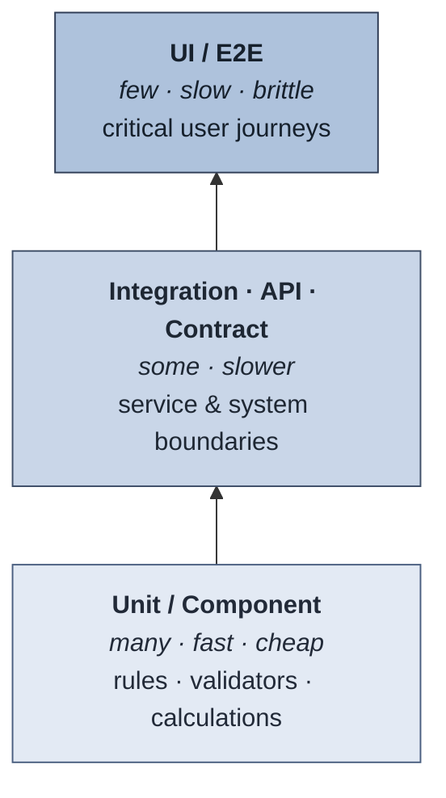
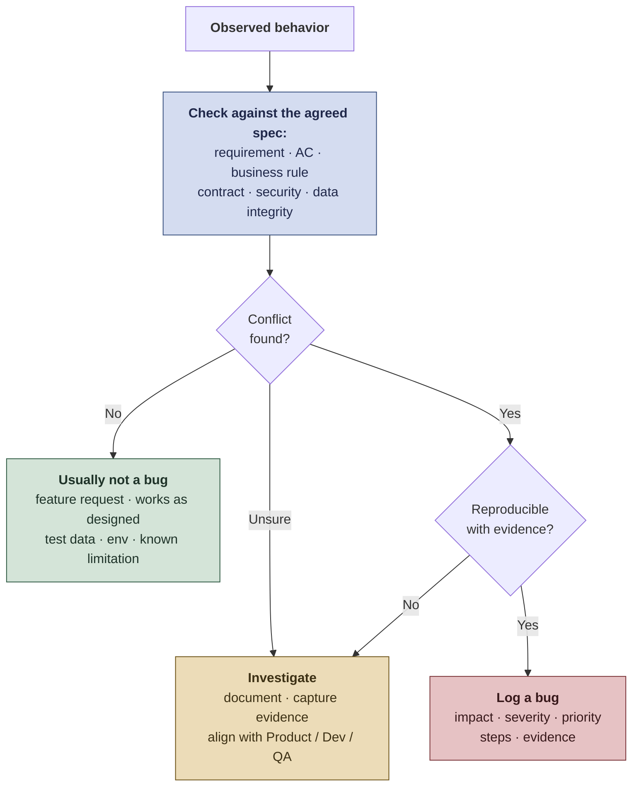
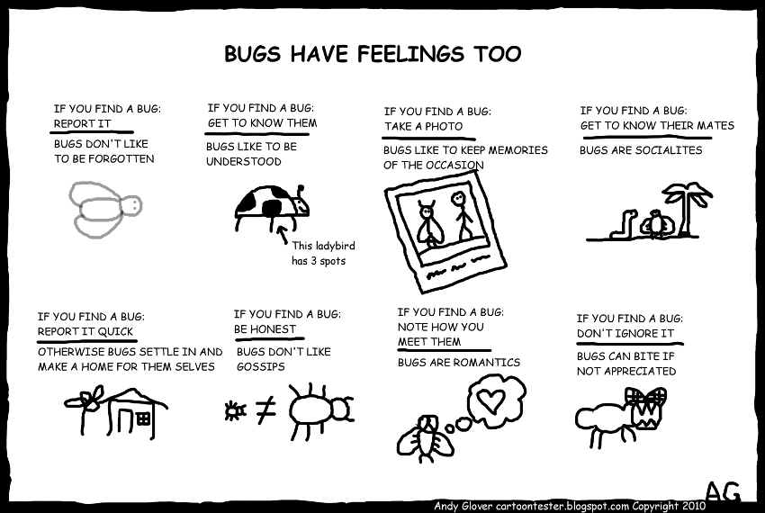

# 02 - During Development

Test design, execution, and collaboration while the work is being built.

The goal during development: **fast feedback, shared ownership, and continuous validation**. QA is not the final gate after everything is built - QA helps the team build the right thing, test the right risks, and catch problems while they are still cheap to fix.

> **Key idea:** QA is not only testing finished work. QA helps the team make better technical and product decisions during implementation.

Companion reference: [Quality Review Checklist - During development](resources/quality-review-checklist.md#during-development).

## Outcomes expected during development

During implementation, the team validates changes incrementally, reviews risk before merge, tests at the right level, checks developer quality signals, automates valuable checks, and keeps defects, evidence, and quality visible to everyone - converging on the [Definition of Done](#15-definition-of-done).

## 1. Collaborate before the handoff

Avoid the pattern where development finishes and QA receives a surprise.

### Better practices

- QA reviews scenarios while development is still in progress.
- Developer and QA do quick pair testing before formal QA.
- QA asks for logs, test hooks, or test data improvements early.
- Developers share implementation notes that may affect testing.
- Product clarifies ambiguous behavior as soon as questions appear.

> **Useful question:** What can we validate today instead of waiting until the entire feature is done?

## 2. Check developer quality signals

QA does not need to own unit testing, but QA should understand whether the change is protected at the right technical level.

### Signals to review with developers

- Unit tests added or updated for business rules, validators, calculations, and transformations
- Integration or component tests added when behavior crosses boundaries
- Static analysis reviewed, such as SonarQube issues, code smells, duplication, and security hotspots
- CI pipeline passing
- Code coverage meaningful for the changed area, not only globally high
- Error handling and logs included for risky flows

For deeper guidance, see the [Unit Testing Guide for QA](resources/unit-test-guide.md).

> **Practical question:** Which risks are protected by developer tests, and which risks still need QA validation?

## 3. Participate in PR review as a QA task

Pull request review is not only a developer activity. QA can review changes through a risk and testability lens.

### QA PR review focus

- Does the change match the requirement and acceptance criteria?
- Are edge cases and negative paths considered?
- Are unit/API/integration tests included at the right level?
- Are logs, errors, and validation messages useful?
- Does the change affect existing flows, contracts, permissions, or data?
- Are feature flags, configs, migrations, or environment differences clear?
- Are documentation, user guide, or how-to-test notes needed?

For deeper guidance, see the [Clean Code Review Guide for QA](resources/clean-code-guide.md).

QA does not need to approve implementation style, but can raise risks that affect validation and release confidence.

> **Real world:** QA reviewing every pull request does not survive contact with a normal sprint. Pick the ones that earn it: changes to permissions or authorization, data transformations and migrations, anything touching a contract other teams depend on, areas with defect history, and anything a developer flags as risky. Skip the rest without guilt.

## 4. Use the right test level for the risk

Not everything should be tested through the UI. Strong QA strategy uses different layers.

| Test level | Best for |
|---|---|
| Unit tests | Business rules, validators, calculations, small transformations |
| Component tests | Isolated service behavior |
| API tests | Contracts, status codes, payloads, errors, integration rules |
| Contract tests | Compatibility between providers and consumers |
| Integration tests | End-to-end communication between systems |
| UI tests | Critical user journeys and visual/user-facing behavior |
| Exploratory testing | Unknown risks, usability, edge cases, workflow quality |
| Regression tests | Protecting existing critical flows |

> **Principle:** Test at the lowest level that can catch the problem; move up only when a lower level cannot. Unit and API tests are faster and more stable than UI tests.



The shading is a cost gradient, darker meaning slower and more expensive to run. It is not a risk rating: across this playbook, red is reserved for risk and severity.

> **Example:** One feature, three levels. A tax calculation -> unit test. An order syncing across two services -> integration/contract test. The checkout journey the user sees -> one UI/E2E test. Each risk validated at its cheapest reliable layer.

> **Data point:** A defect fixed after release can cost **~100× more** than one caught at requirements or design (Boehm & Basili) - less on small projects, far more on safety-critical ones. Testing low and early keeps defects cheap. See [References](README.md#references-and-inspiration).

For a broader reference and a context-to-validation map, see the [Testing Types Reference](resources/testing-types.md#practical-selection-guide).

## 5. Design tests around risk and value

For each story, prioritize:

1. Critical happy path
2. Most likely failure paths
3. Highest-impact edge cases
4. Integration and data risks
5. Regression around affected areas
6. User experience and clarity

### Test design prompts

- What input could break this?
- What user behavior could be unexpected?
- What system dependency could fail?
- What data could be missing, duplicated, outdated, or invalid?
- What existing flow could regress?
- What would be hard to troubleshoot later?

## 6. Run exploratory testing with a charter

Scripted tests check what you already thought of. Exploratory testing finds what you did not - and it is not "clicking around". It is a disciplined activity where learning, test design, and execution happen at the same time, inside a time box, aimed at a stated question.

### The charter

One sentence that gives the session a target. Without it, exploration drifts back to the happy path everyone already trusts.

```text
Explore [area]
with [data, role, tool, or condition]
to discover [risk or information].
```

Example:

```text
Explore bulk record import
with files containing duplicates, wrong encodings, and missing required columns
to discover how partial failures are reported to the user and recorded in the logs.
```

### Running a session

| Step | What it looks like |
|---|---|
| Time box | 60 or 90 minutes. Shorter loses depth, longer loses focus. |
| Take notes as you go | What you tried, what you saw, what surprised you, what you did not reach. |
| Follow surprises | An unexpected result is the point of the session, not a distraction from it. |
| Log questions, not only bugs | "Why does this take four seconds?" often matters more than the typo you found. |
| Debrief | Five minutes with someone else: what was covered, what was found, what still worries you. |

### Heuristics when you get stuck

- **Boundaries:** zero, one, many, maximum, one past maximum, negative, empty.
- **Interruptions:** refresh, back button, double submit, session timeout, lost connection.
- **Wrong order:** skip a step, repeat a step, do them backwards.
- **Bad data:** wrong type, wrong encoding, enormous, empty, hostile.
- **Someone else's data:** another tenant, another role, an expired token.
- **Time:** a slow network, a fast double-click, a request that arrives twice.

### The user's situation

The heuristics above break the system. These break the *assumption that the user is you*: rested, informed, unhurried, on a good connection, working in their first language, looking at the screen.

- **First time, not hundredth time.** You know where the button is. They do not. Does the screen explain itself?
- **Under pressure.** Someone doing this at 2am during an outage, or with a customer waiting on the phone. What do they misread when they are rushing?
- **Interrupted.** They leave mid-task and come back in twenty minutes. Is their work still there?
- **Not a native speaker**, or reading a translation that is 40% longer than the English.
- **Using a keyboard, a screen reader, or a phone on one bar of signal.**
- **Already annoyed**, because this is the third time they have tried.

> **Real world:** watching one real person use the feature without helping them beats an afternoon of guessing. Many QAs in enterprise or regulated products never get that access. If you do not, get as close as you can: Support calls and ticket wording, training staff, field teams, session recordings, and the workarounds users invented on their own.

Exploratory testing gets dismissed as unstructured because it is usually *reported* that way. State what was aimed at, what was actually covered, what was not, and turn findings into bugs, questions, or regression cases.

> **Principle:** exploratory testing is not the opposite of planned testing. It is planned testing where the plan is a question rather than a script.

Charter template: [Test Cases Template - Exploratory testing charter](templates/test-cases-template.md#7-exploratory-testing-charter).

## 7. Use environments intentionally

Environment strategy affects test reliability and release confidence.

| Environment | Purpose | QA focus |
|---|---|---|
| Dev | Fast feedback while the change is still being built | Pair testing, early API checks, obvious defects, testability feedback, unit/integration signal review |
| Staging (STG) | Production-like environment; main validation before release | Functional, integration, regression, exploratory testing, test data validation, defect retesting |
| Production | Real user/system behavior after release | Smoke validation when appropriate, monitoring, logs, alerts, user feedback, incident signals |

> **Release reminder:** Dev → Staging → Production is the common baseline. Larger or regulated orgs may add dedicated QA, integration, UAT, or pre-production environments. A feature moving between environments should carry clear build/version information, deployment notes, known risks, and rollback or mitigation awareness.

## 8. Automate strategically

Automation should reduce risk and shorten feedback loops.

### Good automation candidates

- Stable critical user journeys
- API contract validations
- Data transformation checks
- Regression-prone flows
- Repetitive setup or validation steps
- High-risk integrations
- Smoke tests for release and post-deploy validation

### Avoid automating first

- Unstable requirements
- Highly volatile UI
- One-time scenarios
- Tests with unclear expected results
- Flows that require heavy manual judgment

### Automation quality bar

Automated tests should be:

- readable;
- deterministic;
- independent where possible;
- easy to debug;
- tagged by scope and risk;
- connected to CI/CD when valuable;
- maintained as product behavior evolves.

### Where each suite runs

Automation only shortens the feedback loop if it runs at the right moment. The rule is speed: the faster a suite is, the earlier it runs and the more it is allowed to block.

| Stage | What runs | Budget | Blocks? |
|---|---|---|---|
| Pre-commit / local | Linting, unit tests for the changed code | seconds | Yes |
| Pull request | Unit, component, static analysis, small smoke suite | under 10 minutes | Yes |
| Merge to main | Smoke plus critical-path regression, contract tests | under 30 minutes | Yes |
| Nightly | Broad regression, integration, cross-browser | hours | No - reported and triaged next morning |
| Pre-release | Full regression, performance, security scans | as needed | Yes |
| Post-deploy | Smoke against the real environment | minutes | Triggers rollback |

> **Principle:** a suite that blocks a merge must be fast *and* trustworthy. A slow or flaky suite moves to nightly until it is neither.

### When tests go flaky

A flaky test - one that passes and fails without the product changing - is worse than no test. It teaches the team to re-run and move on, and that habit eventually gets applied to a real failure.

Agree the policy once, then apply it without negotiation:

1. **Detect:** track the flake rate per test, not only the suite pass rate.
2. **Quarantine within a day:** out of the blocking gate, still running and reporting.
3. **Own it:** a name and a date, like any other defect. An unowned quarantined test is a deleted test that still costs run time.
4. **Fix the cause:** usually timing, shared state, test data, or environment - rarely the assertion.
5. **Delete after an agreed limit:** if nobody fixes it within two sprints, it was not protecting anything the team valued.

> **Never re-run to green.** A retry that hides a race condition in the test is also hiding one in the product.

## 9. Use AI as an assistant, not as ownership

AI can support QA work, but it does not replace product understanding.

### Useful AI-assisted QA tasks

- Generate test ideas from requirements
- Identify edge cases
- Summarize logs
- Draft bug reports
- Review acceptance criteria
- Suggest automation structure
- Compare expected vs actual data
- Support exploratory testing charters

### Required human validation

- Confirm business context
- Check real user impact
- Validate expected results
- Protect sensitive data
- Review AI-generated tests for correctness
- Decide testing depth based on risk

> **Principle:** AI accelerates analysis. QA provides judgment.

This split is the whole idea behind [QA 5.0](README.md#where-qa-is-heading-qa-50). AI is fast and tireless at the parts of testing that are mechanical. It has never met your user, carries no accountability for the release, and cannot tell you whether an error message will make someone panic. Those stay human, and they are the parts that decide whether the product is actually good.

For reusable assistant configuration and tools, see [AI Tools](ai-tools/README.md).

## 10. Define what is a bug and what is not

A bug is a product behavior that conflicts with a requirement, acceptance criteria, contract, expected user outcome, security rule, data integrity rule, or agreed quality standard.



> **Example:** An API returns `200` with an empty body when the contract requires the created record -> a bug (breaks the contract). A user requests a new sort option that was never in the acceptance criteria -> not a bug, a feature request.

### Usually a bug

- Requirement or acceptance criteria not met
- Incorrect data, missing data, or data corruption
- Broken integration, API, file, event, or workflow
- Security, permission, or access control issue
- Critical user journey blocked
- Error handling is missing, misleading, or unsafe
- Regression in existing behavior
- Significant usability problem that prevents task completion

### Usually not a bug

- New feature request
- Product decision that works as designed
- Cosmetic preference/improvement without user or brand impact
- Environment issue unrelated to the product change
- Known limitation already documented and accepted
- Test data setup issue caused by invalid preconditions

## 11. Report bugs with resolution in mind

A good bug report helps the team fix the issue faster. Use the [Bug Report Template](templates/bug-report-template.md) for the full structure - it keeps defect documentation clear, reproducible, and consistent across the team.

### The fields most often missing

- **Preconditions:** the state the system had to be in, not only the steps.
- **Impact:** who is affected and what they cannot do.
- **Evidence:** logs, correlation IDs, payloads, or screenshots that prove the behavior.
- **Suspected area:** where to start investigating, when QA already has a signal.

### Good bug title pattern

```text
[Area] Action fails when condition happens
```

Example:

```text
[Checkout] Payment confirmation is not displayed after approved transaction
```

### Severity vs priority

**Severity** is how much damage the defect does. **Priority** is how soon it gets fixed. Both use the same four-point scale across this playbook - Critical, High, Medium, Low - and they move independently:

| | High priority | Low priority |
|---|---|---|
| **High severity** | Checkout crashes for all users - fix now | Data loss in a deprecated admin tool two people still use - schedule |
| **Low severity** | Typo on a legally sensitive public page - fix fast | Minor UI misalignment on an internal page - backlog |

The table shows the four corners. Real triage uses the full scale on both axes, and the two ratings are argued separately: QA usually owns severity, Product usually owns priority.

### Bug advocacy, with a smile

Andy Glover's *Bugs Have Feelings Too* says everything above in eight panels, and says it better.



*Cartoon by [Andy Glover, Cartoon Tester](https://cartoontester.blogspot.com/2010/03/bug-advocacy.html) (2010). Used with permission.*

| If you find a bug | Because |
|---|---|
| Report it | Bugs don't like to be forgotten |
| Get to know them | Bugs like to be understood |
| Take a photo | Bugs like to keep memories of the occasion |
| Get to know their mates | Bugs are socialites |
| Report it quick | Otherwise bugs settle in and make a home for themselves |
| Be honest | Bugs don't like gossips |
| Note how you meet them | Bugs are romantics |
| Don't ignore it | Bugs can bite if not appreciated |

Translated into practice: report it, report it early, understand it before you write it up, back it with evidence, look for the related bugs nearby, and never quietly drop one because it is inconvenient.

## 12. Triage defects as a team

A bug report nobody rates is a bug nobody fixes. Triage is the recurring decision about what happens to each new defect, and it works best as a short, boring, scheduled habit rather than an argument during a release.

### The four questions

For every new defect, in order:

1. **Is it real?** Product, or test data, environment, or a misread requirement?
2. **How bad is it?** Severity - QA proposes, backed by evidence.
3. **How soon?** Priority - Product decides, against everything else in the backlog.
4. **Who owns it next?** A name, not a team.

### Making it work

| Practice | Why |
|---|---|
| Short and regular | 15-20 minutes, two or three times a week, beats a two-hour session the day before release. |
| Three people minimum | QA, a developer, Product. With fewer, the decision gets revisited later anyway. |
| Decide, do not investigate | If it needs research, assign the research and move on. Triage stalls the moment it turns into debugging. |
| Keep severity and priority apart | Different owners, different grounds. Collapsing them hides the trade-off being made. |
| Age the backlog out loud | Review anything open past an agreed age. Defects do not improve with time, they just stop being visible. |

### Agree the escalation rule in advance

Write this down before the first argument about it:

| Severity | Response |
|---|---|
| Critical | Stop and fix now. Interrupt whoever is needed, out of hours if the rule says so. |
| High | Fixed in the current sprint, or the release is reconsidered. |
| Medium | Scheduled and tracked, or explicitly accepted if deferred. |
| Low | Backlog, reviewed periodically, and closed honestly when it will never be done. |

### Keep a person in the conversation

Triage is where the user quietly disappears. Defects get discussed as components and effort, and the thing that gets deprioritized is whatever nobody in the room can picture happening to anyone.

One habit fixes most of it: **say who is affected and what they cannot do, before anyone proposes a priority.**

- "A user who forgot their password cannot get back into their account" is a decision.
- "Auth reset endpoint returns 500 intermittently" is a ticket.

Same defect. Only one of them gets fixed this sprint.

Where the signal comes from when you cannot observe users directly: support tickets, the questions Support keeps having to answer, session recordings, and the workarounds people have invented on their own. A workaround in the wild is a defect the team never logged.

> **Real world:** the most valuable triage outcome is often "not a bug, our acceptance criteria were wrong". That is a requirements defect, and naming it as one is the cheapest signal you will ever get that refinement needs work.

## 13. Collect evidence that proves behavior

Evidence should make validation clear and reusable.

### Examples

- **User-facing:** screenshots or short videos, before/after behavior.
- **Technical:** API requests and responses, logs with correlation IDs, input and output files, database record comparison when appropriate.
- **Automated:** test execution results, CI pipeline result, link to the automated test.

Good evidence reduces rework, improves trust, and helps future debugging.

## 14. Document user guides and how-to-test notes

Documentation is part of quality when it helps users, support, QA, and developers validate or operate the feature correctly.

### User guide updates

Update user-facing or support-facing documentation when the change affects:

- user workflow;
- permissions or roles;
- configuration;
- error messages;
- expected behavior;
- operational steps;
- known limitations.

### How-to-test notes

Add lightweight technical notes when the feature needs specific validation context:

- environment setup;
- test users and roles;
- required data;
- API payloads or files;
- feature flags or configuration;
- expected logs;
- troubleshooting tips.

A good how-to-test note makes future regression faster and reduces knowledge loss.

## 15. Definition of Done

A change is done when the acceptance criteria are met and validated, regression risk is covered, evidence is attached, no critical or high defect is left unaccepted, and Product, QA, and Dev agree it is ready for the next step.

Quality attributes ([Quality Attributes Guide](resources/quality-attributes-guide.md)), useful logs, updated documentation, and communicated risks belong to that bar in proportion to the change.

The full checklist, the high-risk add-ons, and the record of which test levels this team requires live in the [Definition of Ready & Definition of Done Template](templates/definition-of-ready-done-template.md).

## During development checklist

The work items of this phase. The completion gate itself lives in the [Definition of Done](#15-definition-of-done) and is not repeated here.

- [ ] QA and Dev aligned before handoff.
- [ ] QA reviewed PR risk/testability when relevant.
- [ ] Risk-based scenarios designed.
- [ ] Right test levels selected.
- [ ] Exploratory session run where the behavior is new or uncertain.
- [ ] Correct environment used for the validation purpose.
- [ ] Automation opportunities reviewed, and flaky tests quarantined rather than ignored.
- [ ] Defects classified, triaged, and documented clearly.
- [ ] Definition of Done met.

## Key message

> QA is not only a tester.  
> QA is a quality strategist who helps the team make better technical and product decisions while the work is being built.

---

**Playbook:** [← 01 - Before Development](01-before-development.md) · **02 - During Development** · [03 - After Development →](03-after-development.md)  
[↑ Back to README](README.md)
