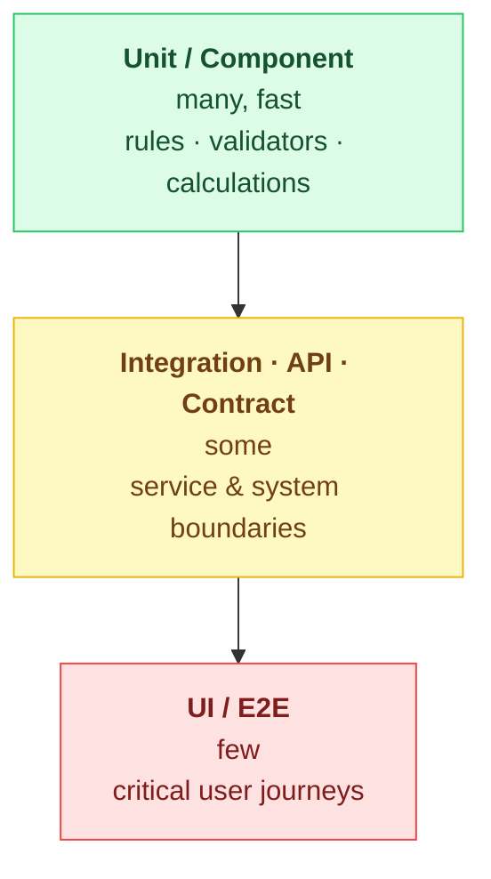
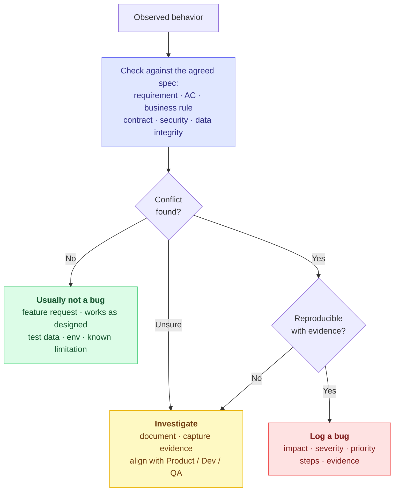

# 02 - During Development

Test design, execution, and collaboration while the work is being built.

The goal during development: **fast feedback, shared ownership, and continuous validation**. QA is not the final gate after everything is built — QA helps the team build the right thing, test the right risks, and catch problems while they are still cheap to fix.

> **Key idea:** QA is not only testing finished work. QA helps the team make better technical and product decisions during implementation.

## On this page

1. [Collaborate before the handoff](#1-collaborate-before-the-handoff)
2. [Check developer quality signals](#2-check-developer-quality-signals)
3. [Participate in PR review as a QA task](#3-participate-in-pr-review-as-a-qa-task)
4. [Use the right test level for the risk](#4-use-the-right-test-level-for-the-risk)
5. [Design tests around risk and value](#5-design-tests-around-risk-and-value)
6. [Use environments intentionally](#6-use-environments-intentionally)
7. [Automate strategically](#7-automate-strategically)
8. [Use AI as an assistant, not as ownership](#8-use-ai-as-an-assistant-not-as-ownership)
9. [Define what is a bug and what is not](#9-define-what-is-a-bug-and-what-is-not)
10. [Report bugs with resolution in mind](#10-report-bugs-with-resolution-in-mind)
11. [Collect evidence that proves behavior](#11-collect-evidence-that-proves-behavior)
12. [Document user guides and how-to-test notes](#12-document-user-guides-and-how-to-test-notes)
13. [Definition of Done](#13-definition-of-done)

Companion reference: [Quality Review Checklist - During development](resources/quality-review-checklist.md#during-development).

## Outcomes expected during development

During implementation, the team validates changes incrementally, reviews risk before merge, tests at the right level, checks developer quality signals, automates valuable checks, and keeps defects, evidence, and quality visible to everyone — converging on the [Definition of Done](#13-definition-of-done).

## 1. Collaborate before the handoff

Avoid the pattern where development finishes and QA receives a surprise.

### Better practices

- QA reviews scenarios while development is still in progress.
- Developer and QA do quick pair testing before formal QA.
- QA asks for logs, test hooks, or test data improvements early.
- Developers share implementation notes that may affect testing.
- Product clarifies ambiguous behavior as soon as questions appear.

> **Useful question:** What can we validate today instead of waiting until the entire feature is done?

## 2. Check developer quality signals

QA does not need to own unit testing, but QA should understand whether the change is protected at the right technical level.

### Signals to review with developers

- Unit tests added or updated for business rules, validators, calculations, and transformations
- Integration or component tests added when behavior crosses boundaries
- Static analysis reviewed, such as SonarQube issues, code smells, duplication, and security hotspots
- CI pipeline passing
- Code coverage meaningful for the changed area, not only globally high
- Error handling and logs included for risky flows

For deeper guidance, see the [Unit Testing Guide for QA](resources/unit-test-guide.md).

> **Practical question:** Which risks are protected by developer tests, and which risks still need QA validation?

## 3. Participate in PR review as a QA task

Pull request review is not only a developer activity. QA can review changes through a risk and testability lens.

### QA PR review focus

- Does the change match the requirement and acceptance criteria?
- Are edge cases and negative paths considered?
- Are unit/API/integration tests included at the right level?
- Are logs, errors, and validation messages useful?
- Does the change affect existing flows, contracts, permissions, or data?
- Are feature flags, configs, migrations, or environment differences clear?
- Are documentation, user guide, or how-to-test notes needed?

For deeper guidance, see the [Clean Code Review Guide for QA](resources/clean-code-guide.md).

QA does not need to approve implementation style, but can raise risks that affect validation and release confidence.

## 4. Use the right test level for the risk

Not everything should be tested through the UI. Strong QA strategy uses different layers.

| Test level | Best for |
|---|---|
| Unit tests | Business rules, validators, calculations, small transformations |
| Component tests | Isolated service behavior |
| API tests | Contracts, status codes, payloads, errors, integration rules |
| Contract tests | Compatibility between providers and consumers |
| Integration tests | End-to-end communication between systems |
| UI tests | Critical user journeys and visual/user-facing behavior |
| Exploratory testing | Unknown risks, usability, edge cases, workflow quality |
| Regression tests | Protecting existing critical flows |

> **Principle:** Push tests as low as possible and as high as necessary.



> **Why low and early wins:** the later a defect is found, the more it costs to fix. Boehm & Basili found that fixing a problem after release is often **~100× more expensive** than fixing it during requirements or design — less on small projects, far more on safety-critical ones. Catching defects at the unit and integration layers keeps them cheap. See [References](README.md#references-and-inspiration).

For a broader reference and a context-to-validation map, see the [Testing Types Reference](resources/testing-types.md#practical-selection-guide).

## 5. Design tests around risk and value

For each story, prioritize:

1. Critical happy path
2. Most likely failure paths
3. Highest-impact edge cases
4. Integration and data risks
5. Regression around affected areas
6. User experience and clarity

### Test design prompts

- What input could break this?
- What user behavior could be unexpected?
- What system dependency could fail?
- What data could be missing, duplicated, outdated, or invalid?
- What existing flow could regress?
- What would be hard to troubleshoot later?

## 6. Use environments intentionally

Environment strategy affects test reliability and release confidence.

| Environment | Purpose | QA focus |
|---|---|---|
| Dev | Fast feedback while the change is still being built | Pair testing, early API checks, obvious defects, testability feedback, unit/integration signal review |
| QA/Test | Main validation environment before release | Functional, integration, regression, exploratory testing, test data validation, defect retesting |
| Production | Real user/system behavior after release | Smoke validation when appropriate, monitoring, logs, alerts, user feedback, incident signals |

> **Release reminder:** Some teams may also have a staging or pre-production environment. A feature moving between environments should have clear build/version information, deployment notes, known risks, and rollback or mitigation awareness when needed.

## 7. Automate strategically

Automation should reduce risk and shorten feedback loops.

### Good automation candidates

- Stable critical user journeys
- API contract validations
- Data transformation checks
- Regression-prone flows
- Repetitive setup or validation steps
- High-risk integrations
- Smoke tests for release and post-deploy validation

### Avoid automating first

- Unstable requirements
- Highly volatile UI
- One-time scenarios
- Tests with unclear expected results
- Flows that require heavy manual judgment

### Automation quality bar

Automated tests should be:

- readable;
- deterministic;
- independent where possible;
- easy to debug;
- tagged by scope and risk;
- connected to CI/CD when valuable;
- maintained as product behavior evolves.

## 8. Use AI as an assistant, not as ownership

AI can support QA work, but it does not replace product understanding.

### Useful AI-assisted QA tasks

- Generate test ideas from requirements
- Identify edge cases
- Summarize logs
- Draft bug reports
- Review acceptance criteria
- Suggest automation structure
- Compare expected vs actual data
- Support exploratory testing charters

### Required human validation

- Confirm business context
- Check real user impact
- Validate expected results
- Protect sensitive data
- Review AI-generated tests for correctness
- Decide testing depth based on risk

> **Principle:** AI accelerates analysis. QA provides judgment.

For reusable assistant configuration and tools, see [AI Tools](ai-tools/README.md).

## 9. Define what is a bug and what is not

A bug is a product behavior that conflicts with a requirement, acceptance criteria, contract, expected user outcome, security rule, data integrity rule, or agreed quality standard.



### Usually a bug

- Requirement or acceptance criteria not met
- Incorrect data, missing data, or data corruption
- Broken integration, API, file, event, or workflow
- Security, permission, or access control issue
- Critical user journey blocked
- Error handling is missing, misleading, or unsafe
- Regression in existing behavior
- Significant usability problem that prevents task completion

### Usually not a bug

- New feature request
- Product decision that works as designed
- Cosmetic preference/improvement without user or brand impact
- Environment issue unrelated to the product change
- Known limitation already documented and accepted
- Test data setup issue caused by invalid preconditions

### When unsure

Document the observation, impact, evidence, and question. Then align with Product, Dev, and QA before classifying it.

## 10. Report bugs with resolution in mind

A good bug report helps the team fix the issue faster.

### Include

- concise title;
- environment;
- build/version;
- preconditions;
- steps to reproduce;
- expected result;
- actual result;
- evidence;
- impact;
- severity and priority suggestion;
- logs, IDs, payloads, or screenshots when relevant;
- suspected area if known.

Use the [Bug Report Template](templates/bug-report-template.md) to keep defect documentation clear, reproducible, and consistent across the team.

### Good bug title pattern

```text
[Area] Action fails when condition happens
```

Example:

```text
[Checkout] Payment confirmation is not displayed after approved transaction
```

## 11. Collect evidence that proves behavior

Evidence should make validation clear and reusable.

### Examples

- Screenshots or short videos
- API requests and responses
- Logs with correlation IDs
- Test execution results
- Database record comparison when appropriate
- Input and output files
- Before/after behavior
- CI pipeline result
- Link to automated test

Good evidence reduces rework, improves trust, and helps future debugging.

## 12. Document user guides and how-to-test notes

Documentation is part of quality when it helps users, support, QA, and developers validate or operate the feature correctly.

### User guide updates

Update user-facing or support-facing documentation when the change affects:

- user workflow;
- permissions or roles;
- configuration;
- error messages;
- expected behavior;
- operational steps;
- known limitations.

### How-to-test notes

Add lightweight technical notes when the feature needs specific validation context:

- environment setup;
- test users and roles;
- required data;
- API payloads or files;
- feature flags or configuration;
- expected logs;
- troubleshooting tips.

A good how-to-test note makes future regression faster and reduces knowledge loss.

## 13. Definition of Done

A change is done when:

- acceptance criteria are met;
- relevant positive and negative scenarios are validated;
- unit/static analysis/pipeline quality signals are reviewed;
- regression risk is covered;
- critical tests pass;
- automated tests were added or updated when valuable;
- logs and errors are useful for troubleshooting;
- documentation, user guide, how-to-test notes, or release notes are updated when needed;
- known risks are communicated;
- evidence is attached;
- Product/QA/Dev agree the change is ready for the next step.

Use the [Definition of Ready & Definition of Done Template](templates/definition-of-ready-done-template.md) to align team expectations and make completion criteria clear, consistent, and visible.

## During development checklist

- [ ] QA and Dev aligned before handoff.
- [ ] Unit tests and static analysis reviewed when relevant.
- [ ] QA reviewed PR risk/testability when relevant.
- [ ] Risk-based scenarios designed.
- [ ] Right test levels selected.
- [ ] Correct environment used for the validation purpose.
- [ ] Critical paths validated.
- [ ] Negative and edge cases covered.
- [ ] Automation opportunities reviewed.
- [ ] Defects classified and documented clearly.
- [ ] Evidence attached.
- [ ] User guide or how-to-test notes updated when needed.
- [ ] Logs/observability checked when relevant.
- [ ] Definition of Done met.

## Key message

> QA is not only a tester.  
> QA is a quality strategist who helps the team make better technical and product decisions while the work is being built.

---

**Playbook:** [← 01 - Before Development](01-before-development.md) · **02 - During Development** · [03 - After Development →](03-after-development.md)  
[↑ Back to README](README.md)
