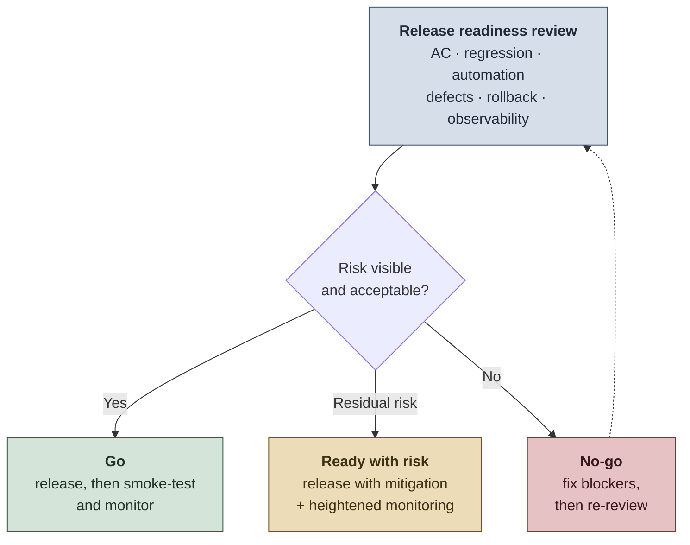
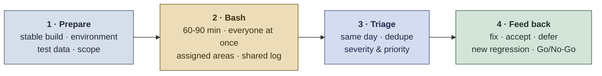

# 03 - After Development

Release confidence, metrics, and continuous improvement after implementation.

The goal after development is to answer one question:

> **Can we release with confidence, detect issues quickly, and learn from what happens next?**

Quality does not end when QA testing is complete - release readiness, production validation, observability, metrics, and retrospectives are part of QA.

## On this page

1. [Define release readiness](#1-define-release-readiness)
2. [Run focused regression](#2-run-focused-regression)
3. [Run a bug bash before big releases](#3-run-a-bug-bash-before-big-releases)
4. [Validate production behavior](#4-validate-production-behavior)
5. [Create a QA report for leadership visibility](#5-create-a-qa-report-for-leadership-visibility)
6. [Use metrics that drive decisions](#6-use-metrics-that-drive-decisions)
7. [Avoid vanity metrics](#7-avoid-vanity-metrics)
8. [Run blame-free post-release reviews](#8-run-blame-free-post-release-reviews)

Companion reference: [Quality Review Checklist - After release](resources/quality-review-checklist.md#after-release).

## Outcomes expected after development

After implementation, the team understands release risk, validates key flows before and after deploy, detects failures quickly, communicates QA status to stakeholders, measures quality trends, and learns from incidents to improve the next cycle - recapped in the [after development checklist](#after-development-checklist).

## 1. Define release readiness

Before release, the team should confirm that the change is functionally correct, technically safe, and operationally observable.

### Release readiness checklist

- [ ] Critical acceptance criteria passed.
- [ ] High-risk regression executed and critical automated tests passing.
- [ ] Known defects reviewed and accepted or fixed.
- [ ] Rollback or mitigation plan understood.
- [ ] Logs and monitoring available for critical flows.
- [ ] Support/Product informed, with release notes or documentation updated when needed.
- [ ] Test evidence attached.
- [ ] Go/No-Go decision made with visible risk.

The checklist feeds one clear decision - release, release with mitigation, or hold:

The expanded version of this gate - functional, regression, technical, and product/support readiness, plus deployment steps and rollback - is in the [Deployment Validation Guide Template](templates/deployment-validation-guide-template.md).

## 2. Run focused regression

Regression should protect what matters most, not blindly repeat everything.

### Regression should prioritize

- critical user journeys;
- high-traffic areas;
- revenue, compliance, safety, or trust-related flows;
- recently changed components;
- historically unstable areas;
- integrations and contracts;
- permissions and data-sensitive flows.

### Good regression questions

- What could this change break?
- Which users would be most affected?
- Which integrations depend on this behavior?
- Which automated tests already protect this?
- What still needs manual judgment?

## 3. Run a bug bash before big releases

Regression protects the risks you already know about. A **bug bash** is a time-boxed session where the whole team attacks a release-candidate build at the same time, looking for the risks nobody wrote a test for. Developers, Product, Support, UX, and QA each break software differently, and the people closest to the code are the least likely to use it the wrong way.

Worth running before a major release, a high-risk integration, a migration, or the first version of a customer-facing flow. Not worth running for routine changes.

> **Invite beyond your squad:** people from close teams - a neighboring squad, Support, Ops, a QA from the Guild - bring perspectives your own team lost the moment it learned how the feature is supposed to work. They ask the questions a new user would, and they are not protecting anything they built.

| Step | What it takes |
|---|---|
| 1. Prepare | A build stable enough to explore, ready test data and accounts, and a clear scope: which areas are in, which are out. |
| 2. Bash | 60-90 minutes, everyone at once, areas or charters assigned so coverage does not collapse onto the same happy path, and one shared place to log findings. |
| 3. Triage | Same day, while context is fresh: dedupe, separate bugs from feature requests and test data noise, then set severity and priority. |
| 4. Feed back | Fix, accept, or defer; turn valuable findings into regression tests or automation candidates; hand residual risk to the Go/No-Go decision. |

### What makes a bug bash fail

- An unstable build, so the session finds environment noise instead of product risk.
- No scope, so everyone retests the same happy path.
- Running it too late for anything found to be fixed.
- No triage, so findings become a backlog nobody reads.

> **Real world:** the hard part is not the session, it is protecting the hour on other people's calendars. Tie it to a release date and keep it short - a focused 60 minutes with six people beats a vague afternoon with two.

To classify what the session surfaces, see [02 - Define what is a bug and what is not](02-during-development.md#9-define-what-is-a-bug-and-what-is-not).

## 4. Validate production behavior

Post-deploy validation confirms that real systems are healthy after release.

### Recommended post-deploy checks

- Smoke test critical journeys.
- Confirm deployment version.
- Check error logs.
- Review monitoring dashboards.
- Validate API/file/event processing when relevant.
- Confirm expected data is created or transformed correctly.
- Check alerts or support channels for early signals.
- Track known risks during the stabilization window.

> **Principle:** A release is not fully complete until the team confirms that production behavior is healthy.

> **Real world:** many QAs have no production access, especially in regulated or enterprise systems. If you cannot touch prod, partner with Ops, SRE, or on-call to run these checks and share the signals - the validation still has to happen, even if you do not run it yourself.

## 5. Create a QA report for leadership visibility

QA reporting should make quality visible without overwhelming stakeholders.

### A strong QA report includes

- Scope tested and not tested
- Release recommendation: Ready / Ready with risk / Not ready
- Key risks and mitigations
- Test execution summary
- Critical defects and current status
- Escaped defects or production concerns when relevant
- Automation and regression coverage for critical flows
- Environment or test data blockers
- User impact and business impact
- Metrics trend and improvement actions

### Recommended format

Use a concise one-page document or short presentation for leadership and a more detailed dashboard for the team.

> **Principle:** Leadership does not need every test step. They need the risk picture, release confidence, business impact, and decisions required.

## 6. Use metrics that drive decisions

Metrics should help the team improve quality, not create blame. Start small: a strong QA metric set covers five complementary signal types, and every metric in it has a target and an agreed action.

> **Rule:** If a metric has no target and no agreed action when it breaches, do not track it.

| Signal type | Starter metric | What it shows | Action when it moves the wrong way |
|---|---|---|---|
| **Outcome** | Escaped defects | What reached users or production | Review risk analysis and regression strategy; when defects trace back to requirements, strengthen refinement and the Definition of Ready |
| **Outcome** | Production incidents | Real stability and operational impact | Run root cause analysis; if incidents repeat in one area, add targeted regression there |
| **Outcome** | Change failure rate | How release quality connects to delivery performance | Strengthen release readiness and post-deploy monitoring |
| **Outcome** | Support ticket trend | Real user friction | Prioritize the user pain points behind the tickets |
| **Delivery health** | Reopened defect rate | Unclear fixes, weak validation, or poor communication | Improve fix validation and acceptance criteria |
| **Delivery health** | Validation cycle time | QA blockers, test data gaps, or environment problems | Review test data, environment stability, and automation opportunities |
| **Automation health** | Critical-flow automation coverage | Whether automation protects what matters most | Automate the highest-risk uncovered flow next |
| **Automation health** | Flaky test rate | Trust in automation results | Stabilize the suite before expanding coverage |
| **Observability** | MTTD / MTTR | How fast the team detects and recovers from issues | Add logs, alerts, correlation IDs, or dashboard visibility |
| **Culture and maturity** | Team QA maturity trend | Whether quality practices improve over time | Build a focused improvement plan with the team |

For a detailed dashboard format, formulas, and data sources, see [QA Metrics Dashboard Template](templates/qa-metrics-dashboard-template.md).

## 7. Avoid vanity metrics

Some metrics look impressive but do not prove quality by themselves. Use these with context:

- total number of test cases;
- raw test coverage percentage;
- number of bugs found by QA;
- number of automated tests;
- number of executed scenarios.

These can be useful only when connected to risk, critical-flow coverage, defect trends, release outcomes, and user impact.

> **Better question:** What decision will this metric help us make?

## 8. Run blame-free post-release reviews

After important releases or incidents, the team should learn without blame.

### Questions to ask

- What happened?
- What was the user or business impact?
- How was it detected?
- Could we have detected it earlier?
- Why did our process or tests miss it?
- What small change would prevent a similar issue?
- Do we need a new test, monitor, alert, checklist item, or documentation update?
- Who owns the follow-up action?

### Output

Every review should produce one or more practical improvements.

Examples:

- add an automated regression test;
- improve logs;
- add a contract validation;
- update Definition of Ready;
- improve test data;
- add a monitoring alert;
- clarify ownership.

## After development checklist

- [ ] Regression completed based on risk.
- [ ] Bug bash run and triaged when the release is big or high-risk.
- [ ] Critical automated tests passing.
- [ ] Release risks documented.
- [ ] QA report or release summary prepared when relevant.
- [ ] Production smoke validation planned.
- [ ] Observability checked.
- [ ] Known defects reviewed.
- [ ] Metrics updated.
- [ ] Post-release feedback reviewed.
- [ ] Lessons learned captured.
- [ ] Follow-up actions assigned.

## Key message

> Quality after development is not about proving that QA tested.  
> It is about proving that the team can release, observe, communicate, learn, and improve.

---

**Playbook:** [01 - Before Development](01-before-development.md) · [← 02 - During Development](02-during-development.md) · **03 - After Development**  
[↑ Back to README](README.md)
