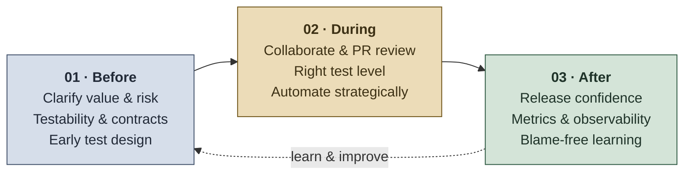
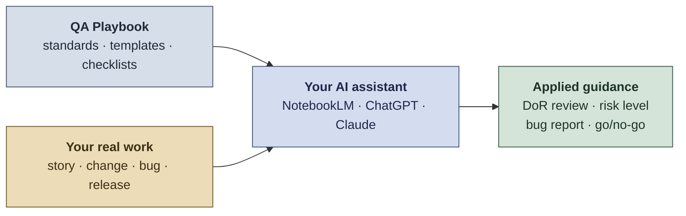

# QA Playbook

A practical Quality Engineering playbook for building reliable software **before, during, and after development**: shift-left practices, risk-based testing, automation, release confidence, AI-assisted workflows, and continuous improvement. Written to be adopted, adapted, and measured by a real team.

By **Paula Marcondes**, Senior QA Engineer. [LinkedIn](https://www.linkedin.com/in/paulamarcondes)

> **Key idea:** Quality is not a final checkpoint. It is a system property built through clear requirements, technical collaboration, smart testing, user focus, and measurable learning.

## What do we even call this job?

Depending on the company, the org chart, and whoever wrote the job description that quarter, the same person is called:

- Quality Assurance
- Quality Assurance Tester
- Quality Assurance Engineer
- Software Tester
- Software Development Engineer in Test (SDET)
- Test Engineer
- QA Analyst
- QA Architect
- QA Intelligence
- Or, when the meeting is already running late, simply **QA**

And before releases, the one who breaks everything.

The title keeps changing. The goal never does: **make sure we deliver the BEST solution possible, so the company's reputation keeps shining in the customer's eyes.**

> **The stakes:** Poor software quality cost the US economy at least **$2.41 trillion** in 2022, roughly **$1.52 trillion** of it locked up in technical debt (CISQ, 2022). Two decades earlier the same problem measured **~$59.5 billion a year**, most of it from defects caught too late (NIST/RTI, 2002). The bill grows with the software. Good QA is how a team stops paying it.

## Start here

A playbook nobody has time to read changes nothing. Pick the row that matches the time you actually have.

| You have | Do this | You get |
|---|---|---|
| **10 minutes** | Read the three things below and the [Quality Review Checklist](resources/quality-review-checklist.md) | The questions that expose most risk, in one page |
| **An hour** | Add [Map risk before defining test depth](01-before-development.md#4-map-risk-before-defining-test-depth) and [Use the right test level](02-during-development.md#4-use-the-right-test-level-for-the-risk) | The two decisions everything else follows from: how deep, and at which layer |
| **A sprint** | Agree a [Definition of Ready and Done](templates/definition-of-ready-done-template.md) with 3-5 items, not the full list | One shared bar, applied consistently, before anything else is added |
| **A quarter** | Run the [QA Assessment Survey](templates/qa-assessment-survey-template.md), fix the three lowest-scoring areas, re-run it | Evidence that practice changed, not just that documents exist |

### If you only do three things

1. **Classify risk before deciding test depth.** Everything else in this playbook follows from it.
2. **Test at the lowest level that can catch the problem.** Cheaper, faster, and far more stable than the alternative.
3. **Make failure visible.** Logs, correlation IDs, and monitoring turn "it broke" into "here is what broke, and why".

> **Adopt by subtraction.** Every template here is a menu, not a mandate. Teams that succeed start with the handful of items that hurt them repeatedly, and add more only when something new goes wrong.

## What's inside

| Guide | Purpose |
|---|---|
| [01 - Before Development](01-before-development.md) | Build quality into requirements, risks, contracts, testability, user focus, and early test design. |
| [02 - During Development](02-during-development.md) | Validate continuously, review technical quality signals, support PR review, and automate smartly. |
| [03 - After Development](03-after-development.md) | Measure release confidence, production quality, post-release learning, and continuous improvement. |

### Resources

| Resource | Purpose |
|---|---|
| [Testing Types Reference](resources/testing-types.md) | Verification vs validation, testing levels, types, techniques, and practical selection guidance. |
| [Quality Attributes Guide](resources/quality-attributes-guide.md) | Accessibility, internationalization, security, performance, and privacy: what breaks, the minimum bar, and what blocks a release. |
| [QA Operating Model](resources/qa-operating-model.md) | Who owns what, [what quality needs from leadership](resources/qa-operating-model.md#2-what-quality-needs-from-leadership), QA across time zones and vendor teams, maturity, and the QA Guild. |
| [QA SDLC Glossary](resources/qa-sdlc-glossary.md) | Shared terminology for QA, SDLC, testing, delivery, AI, and metrics. |
| [Quality Review Checklist](resources/quality-review-checklist.md) | Outcome-based quality questions for refinement, development, PRs, bugs, and releases. |
| [Clean Code Review Guide for QA](resources/clean-code-guide.md) | How QA can review code and PRs from a risk, testability, and observability perspective. |
| [Unit Testing Guide for QA](resources/unit-test-guide.md) | How QA can collaborate with developers on meaningful unit testing strategy. |

### Templates

| Template | Purpose |
|---|---|
| [Story / Requirements / Interface Document](templates/story-requirements-template.md) | Structure for clear, testable, user-focused requirements and contracts. |
| [Test Strategy](templates/test-strategy-template.md) | Risk assessment, scope, approach, tools, automation, observability, and release confidence. |
| [Test Cases](templates/test-cases-template.md) | Plain-text scenario documentation for manual, exploratory, API, integration, regression, and automation candidate scenarios. |
| [Definition of Ready & Definition of Done](templates/definition-of-ready-done-template.md) | Practical quality standards for readiness and completion. |
| [QA Assessment Survey](templates/qa-assessment-survey-template.md) | Team survey for quality maturity, collaboration, tooling, and improvement. |
| [Bug Report](templates/bug-report-template.md) | Clear defect documentation focused on reproduction, impact, evidence, and technical context. |
| [Deployment Validation Guide](templates/deployment-validation-guide-template.md) | Release readiness, validation, rollback awareness, monitoring, and post-release learning. |
| [QA Metrics Dashboard](templates/qa-metrics-dashboard-template.md) | Quality visibility model for trends, risks, bottlenecks, and decisions. |

### AI tools

Always-on QA instructions, two agents, and the skills behind them, including four **QA Checkers** that compare requirements, deliverables, code, and fixes against the standard each should meet. Full list and usage: [ai-tools/README.md](ai-tools/README.md).

## Where QA is heading: QA 5.0

Quality follows the same arc as industry. **Quality 4.0** tied QA to digital transformation, automation, and data. The emerging **QA 5.0** framing - aligned with **Industry 5.0** and **Society 5.0** - turns the focus back to people: user value, accessibility, ethics, sustainability, and human judgment working *with* AI, not replaced by it. This playbook is built for that direction: **AI accelerates the work; humans own the quality and the user experience.**

That is a claim, so here is where it becomes a practice:

| QA 5.0 idea | Where it becomes a practice |
|---|---|
| Start from the person, not the ticket | [Start with user value](01-before-development.md#1-start-with-user-value), including how the product behaves when it fails them |
| Test as a real person would, not as the spec reads | [Exploratory testing](02-during-development.md#6-run-exploratory-testing-with-a-charter), with the user's situation as a heuristic |
| Everyone means everyone | [Accessibility and localization](resources/quality-attributes-guide.md) as release conditions, not polish |
| AI accelerates, humans decide | [Use AI as an assistant, not as ownership](02-during-development.md#9-use-ai-as-an-assistant-not-as-ownership) |
| The user has a name in every decision | [Triage defects as a team](02-during-development.md#12-triage-defects-as-a-team), where priority is set |
| Judge the release by what people experienced | [Blame-free post-release reviews](03-after-development.md#10-run-blame-free-post-release-reviews) |

## Use it with an AI assistant

Turn the playbook into an interactive coach: feed it the standards, point it at your real work, and let it apply one to the other.

Add this repo as a source in NotebookLM, ChatGPT, or Claude (paste the markdown files or add the repo URL), then ask:

- "Review my user story against the Definition of Ready."
- "Per section 4, what risk level and test depth fit this change?"
- "Draft a bug report using the playbook's template."
- "Run the go/no-go checklist against my release."

The playbook supplies the standards; the assistant applies them.

## References and inspiration

This playbook is inspired by Quality Engineering practices, shift-left testing, risk-based testing, DevOps, usability heuristics, AI-assisted QA, and continuous improvement.

Useful references include:

- [DORA Metrics](https://dora.dev/guides/dora-metrics/)
- [Accelerate - Forsgren, Humble & Kim (the science behind the four key delivery metrics)](https://itrevolution.com/product/accelerate/)
- [European Commission - Industry 5.0 (human-centric, sustainable, resilient industry)](https://research-and-innovation.ec.europa.eu/research-area/industrial-research-and-innovation/industry-50_en)
- [Cabinet Office of Japan - Society 5.0 (human-centered super-smart society)](https://www8.cao.go.jp/cstp/english/society5_0/index.html)
- [ASQ - Quality 4.0](https://asq.org/quality-resources/quality-4-0)
- [NIST/RTI - The Economic Impacts of Inadequate Infrastructure for Software Testing (2002)](https://www.nist.gov/document/report02-3pdf)
- [Dijkstra - "Program testing can be used to show the presence of bugs, but never to show their absence" (Notes on Structured Programming, EWD249, 1970; quote via Wikiquote)](https://en.wikiquote.org/wiki/Edsger_W._Dijkstra)
- [Mike Cohn - Succeeding with Agile (test pyramid origin)](https://www.mountaingoatsoftware.com/books/succeeding-with-agile-software-development-using-scrum)
- [Google SRE Book - Monitoring Distributed Systems](https://sre.google/sre-book/monitoring-distributed-systems/)
- [IBM - Shift-left testing](https://www.ibm.com/think/topics/shift-left-testing)
- [Boehm & Basili - Software Defect Reduction Top 10 List (cost of fixing defects by phase, IEEE Computer 2001)](https://www.cs.umd.edu/projects/SoftEng/ESEG/papers/82.78.pdf)
- [Martin Fowler - Test Pyramid](https://martinfowler.com/bliki/TestPyramid.html)
- [ISTQB Glossary](https://glossary.istqb.org/)
- [Atlassian - User Stories](https://www.atlassian.com/agile/project-management/user-stories)
- [Nielsen Norman Group - 10 Usability Heuristics for User Interface Design](https://www.nngroup.com/articles/ten-usability-heuristics/) (and the [heuristics workshop video](https://youtu.be/OtyM8dGKLUU?si=Fu3HYPjSQG3NDAoG))
- [W3C - WCAG 2.2](https://www.w3.org/TR/WCAG22/)
- [ETSI EN 301 549 - Accessibility requirements for ICT products and services](https://www.etsi.org/deliver/etsi_en/301500_301599/301549/03.02.01_60/en_301549v030201p.pdf)
- [CISQ - The Cost of Poor Software Quality in the US: A 2022 Report (Herb Krasner)](https://www.it-cisq.org/the-cost-of-poor-quality-software-in-the-us-a-2022-report/)
- [Cartoon Tester - Bug Advocacy / "Bugs Have Feelings Too" (Andy Glover, 2010)](https://cartoontester.blogspot.com/2010/03/bug-advocacy.html)

## License

Released under the [MIT License](LICENSE). You are free to use, adapt, and share this playbook, with attribution. Version history: [changelog](CHANGELOG.md). How to propose a change: [contributing](CONTRIBUTING.md).

**One exception:** the cartoon [*Bugs Have Feelings Too*](02-during-development.md#bug-advocacy-with-a-smile) is Copyright 2010 [Andy Glover (Cartoon Tester)](https://cartoontester.blogspot.com), included here with his permission. It is not covered by the MIT License and is not sub-licensed. To reuse it, ask him directly.

## Author

Created by **Paula Marcondes**, a **Senior QA Engineer**.

**QA is my second career.** Before moving into tech, I spent 10+ years in international Customer Experience and leadership roles at Royal Caribbean International and Walt Disney World - a decade of watching real people succeed or struggle with a service, in real time, with nowhere to hide.

I did not leave that behind when I changed careers. It is the lens I test through, and it runs through this entire playbook: a feature is only as good as the experience of the person on the other end of it, and technical decisions matter most for their real impact on the people who use the product.

