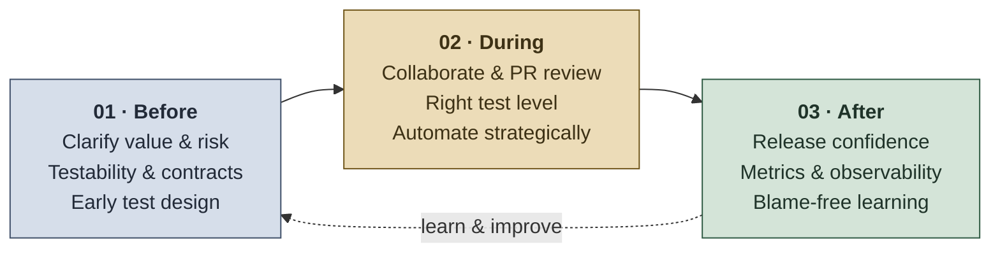
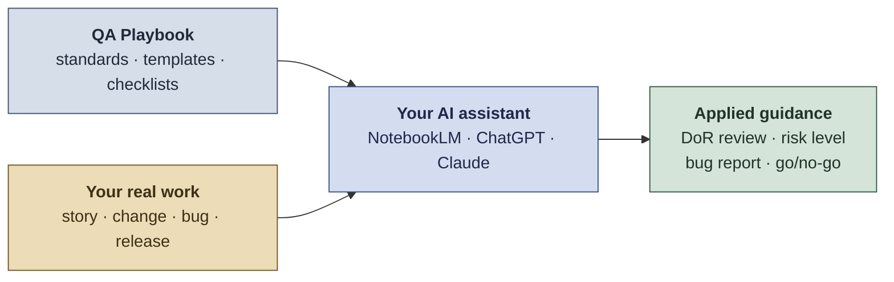

# QA Playbook

A practical Quality Engineering playbook for building reliable software **before, during, and after development**.

This repository is a portfolio project that documents how QA can support delivery through shift-left practices, risk-based testing, automation, release confidence, AI-assisted workflows, and continuous improvement.

> **Key idea:** Quality is not a final checkpoint. It is a system property built through clear requirements, technical collaboration, smart testing, user focus, and measurable learning.

## Contents

- [Why this playbook exists](#why-this-playbook-exists)
- [Quick navigation](#quick-navigation)
- [Core principles](#core-principles)
- [Where QA is heading: QA 5.0](#where-qa-is-heading-qa-50)
- [Playbook structure](#playbook-structure)
- [Recommended use](#recommended-use)
- [References and inspiration](#references-and-inspiration)
- [License](#license)
- [Author](#author)

## Why this playbook exists

> **The stakes:** Weak software testing cost the US economy **~$59.5 billion a year** - most of it from defects caught too late (NIST/RTI, 2002). Good QA prevents exactly that.

Software teams need more than test execution. They need quality practices that help them:

- prevent defects before implementation starts;
- validate what matters most to users and the business;
- reduce regression and production risk;
- make failures visible, traceable, and actionable;
- choose the right test strategy, tools, and automation approach;
- use AI responsibly to improve feedback loops;
- learn from releases, incidents, metrics, and team maturity signals.

This playbook is intentionally concise and practical. It is designed to be reused by QA Engineers, Developers, Product Owners, Tech Leads, and teams that want to make quality part of the delivery system.

## Quick navigation

| Section | Purpose |
|---|---|
| [01 - Before Development](01-before-development.md) | Build quality into requirements, risks, contracts, testability, user focus, and early test design. |
| [02 - During Development](02-during-development.md) | Validate continuously, review technical quality signals, support PR review, and automate smartly. |
| [03 - After Development](03-after-development.md) | Measure release confidence, production quality, post-release learning, and continuous improvement. |
| [Resources](resources/) | Practical QA references for testing, clean code, unit testing, glossary, and review checklists. |
| [Templates](templates/) | Reusable templates for stories, strategy, test cases, bugs, DoR/DoD, deployment, metrics, and maturity assessment. |
| [AI Tools](ai-tools/) | Reusable AI instructions, agents, and skills for QA workflows. |

## Core principles

1. **Prevention beats detection**  
   The best bug is the one removed during refinement, design, or code review.

2. **User value drives quality**  
   A technically correct feature still fails if users cannot complete the journey with clarity, trust, and low friction.

3. **Risk drives testing depth**  
   Critical flows, integrations, data transformations, security, payments, permissions, and customer-impacting changes deserve deeper validation.

4. **Quality is a team responsibility**  
   QA leads quality thinking, but Developers, Product, UX, Support, and Engineering leaders all contribute to product confidence.

5. **Automation accelerates feedback**  
   Automated tests should protect critical paths, contracts, integrations, and repetitive checks. Automation is not a goal by itself.

6. **Humans protect context**  
   AI can help generate ideas, analyze logs, summarize requirements, and speed up test design, but human judgment remains essential for product risk, usability, ethics, and real user impact.

7. **Metrics should improve decisions**  
   Good QA metrics reveal risk, bottlenecks, learning opportunities, and product impact. They should never be used to blame people.

## Where QA is heading: QA 5.0

Quality follows the same arc as industry. **Quality 4.0** tied QA to digital transformation, automation, and data. The emerging **QA 5.0** framing - aligned with **Industry 5.0** and **Society 5.0** - turns the focus back to people: user value, accessibility, ethics, sustainability, and human judgment working *with* AI, not replaced by it.

This playbook is built for that direction: **AI accelerates the work; humans own the quality and the user experience**. It rewards QA that brings the lens of people-centered disciplines - customer experience, UX, service design - into engineering decisions.

## Playbook structure

The three core guides ([01 - Before](01-before-development.md), [02 - During](02-during-development.md), [03 - After](03-after-development.md)) are mapped in [Quick navigation](#quick-navigation) above. The resources, templates, and AI tools that support them are listed below.

### Resources

| Resource | Purpose |
|---|---|
| [Testing Types Reference](resources/testing-types.md) | Testing levels, types, techniques, and practical selection guidance. |
| [QA SDLC Glossary](resources/qa-sdlc-glossary.md) | Shared terminology for QA, SDLC, testing, delivery, AI, and metrics. |
| [Quality Review Checklist](resources/quality-review-checklist.md) | Outcome-based quality questions for refinement, development, PRs, bugs, and releases. |
| [Clean Code Review Guide for QA](resources/clean-code-guide.md) | How QA can review code and PRs from a risk, testability, and observability perspective. |
| [Unit Testing Guide for QA](resources/unit-test-guide.md) | How QA can collaborate with developers on meaningful unit testing strategy. |

### Templates

| Template | Purpose |
|---|---|
| [Story / Requirements / Interface Document Template](templates/story-requirements-template.md) | Structure for clear, testable, user-focused requirements and contracts. |
| [Test Strategy Template](templates/test-strategy-template.md) | Risk assessment, scope, approach, tools, automation, observability, and release confidence. |
| [Test Cases Template](templates/test-cases-template.md) | Plain-text scenario documentation for manual, exploratory, API, integration, regression, and automation candidate scenarios. |
| [Definition of Ready & Definition of Done Template](templates/definition-of-ready-done-template.md) | Practical quality standards for readiness and completion. |
| [QA Assessment Survey Template](templates/qa-assessment-survey-template.md) | Team survey for quality maturity, collaboration, tooling, and improvement. |
| [Bug Report Template](templates/bug-report-template.md) | Clear defect documentation focused on reproduction, impact, evidence, and technical context. |
| [Deployment Validation Guide Template](templates/deployment-validation-guide-template.md) | Release readiness, validation, rollback awareness, monitoring, and post-release learning. |
| [QA Metrics Dashboard Template](templates/qa-metrics-dashboard-template.md) | Quality visibility model for trends, risks, bottlenecks, and decisions. |

### AI tools

| File | Purpose |
|---|---|
| [AI Tools README](ai-tools/README.md) | Navigation and usage guidance for the AI tools folder. |
| [BASICS.instructions.md](ai-tools/BASICS.instructions.md) | Always-on QA context and AI safety rules. |
| [Manual QA Agent](ai-tools/agents/manual-qa.agent.md) | End-to-end QA workflow agent behavior. |
| [Manual QA Skill](ai-tools/skills/manual-qa/SKILL.md) | QA knowledge base for planning, tests, bugs, reporting, and metrics. |
| [Robot QA Skill](ai-tools/skills/robot-qa/SKILL.md) | Robot Framework automation guidance. |

## Recommended use

Use this playbook as:

- a GitHub portfolio project;
- a reference for QA interviews;
- a team working agreement;
- a starting point for QA process improvement;
- a lightweight quality governance model;
- a foundation for AI-assisted QA workflows.

### Use it with an AI assistant

Turn the playbook into an interactive coach: feed it the standards, point it at your real work, and let it apply one to the other.

Add this repo as a source in NotebookLM, ChatGPT, or Claude (paste the markdown files or add the repo URL), then ask:

- "Review my user story against the Definition of Ready."
- "Per section 4, what risk level and test depth fit this change?"
- "Draft a bug report using the playbook's template."
- "Run the go/no-go checklist against my release."

The playbook supplies the standards; the assistant applies them.

## References and inspiration

This playbook is inspired by Quality Engineering practices, shift-left testing, risk-based testing, DevOps, usability heuristics, AI-assisted QA, and continuous improvement.

Useful references include:

- [DORA Metrics](https://dora.dev/guides/dora-metrics/)
- [Accelerate - Forsgren, Humble & Kim (the science behind the four key delivery metrics)](https://itrevolution.com/product/accelerate/)
- [European Commission - Industry 5.0 (human-centric, sustainable, resilient industry)](https://research-and-innovation.ec.europa.eu/research-area/industrial-research-and-innovation/industry-50_en)
- [Cabinet Office of Japan - Society 5.0 (human-centered super-smart society)](https://www8.cao.go.jp/cstp/english/society5_0/index.html)
- [ASQ - Quality 4.0](https://asq.org/quality-resources/quality-4-0)
- [NIST/RTI - The Economic Impacts of Inadequate Infrastructure for Software Testing (2002)](https://www.nist.gov/document/report02-3pdf)
- [Dijkstra - Notes on Structured Programming, EWD249 ("testing shows the presence, not the absence, of bugs")](https://www.cs.utexas.edu/~EWD/transcriptions/EWD02xx/EWD249/EWD249.html)
- [Mike Cohn - Succeeding with Agile (test pyramid origin)](https://www.mountaingoatsoftware.com/books/succeeding-with-agile-software-development-using-scrum)
- [Google SRE Book - Monitoring Distributed Systems](https://sre.google/sre-book/monitoring-distributed-systems/)
- [IBM - Shift-left testing](https://www.ibm.com/think/topics/shift-left-testing)
- [Boehm & Basili - Software Defect Reduction Top 10 List (cost of fixing defects by phase, IEEE Computer 2001)](https://www.cs.umd.edu/projects/SoftEng/ESEG/papers/82.78.pdf)
- [Martin Fowler - Test Pyramid](https://martinfowler.com/bliki/TestPyramid.html)
- [ISTQB Glossary](https://glossary.istqb.org/)
- [Atlassian - User Stories](https://www.atlassian.com/agile/project-management/user-stories)
- [Nielsen Heuristics Workshop](https://youtu.be/OtyM8dGKLUU?si=Fu3HYPjSQG3NDAoG)
- [Cartoon Tester - Bug Advocacy / "Bugs Have Feelings Too" (Andy Glover, 2010)](https://cartoontester.blogspot.com/2010/03/bug-advocacy.html)
- [Software Testing QA Mind Map](https://mm.tt/map/3489122534?t=03NPIthAMR)

## License

Released under the [MIT License](LICENSE). You are free to use, adapt, and share this playbook, with attribution.

## Author

Created by **Paula Marcondes**, a Quality Assurance Engineer at Motorola Solutions working on mission-critical Public Safety integrations.

My route to QA ran through 10+ years of international customer experience and leadership at Royal Caribbean International and Walt Disney World. That foundation shapes the user-focused, human-centric view of quality throughout this playbook: technical decisions matter most for their real impact on the people who use the product.

