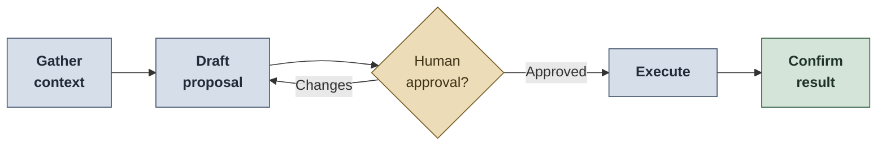

# AI Tools for QA Workflows

Reusable AI assistant templates for Quality Engineering work across the SDLC.

These files help configure AI assistants such as GitHub Copilot, Claude Code, or similar coding agents to support QA activities from requirements review to test strategy, test case design, defect reporting, automation support, and test reporting.

## Goals

- Support shift-left QA practices.
- Improve test planning and test design quality.
- Standardize bug reports, test cases, and QA documentation.
- Keep AI usage safe, concise, and approval-driven.
- Encourage token-efficient workflows using local tools first and MCP only when useful.

## Compatibility note

These files are reusable templates. Folder structure, loading behavior, and feature support vary by AI tool.

- GitHub Copilot custom instructions and prompts may require placement in your VS Code or repository configuration.
- Claude Code supports agents and skills, but file locations may vary depending on local or global setup.
- Other AI tools may require copying the relevant content into their own instruction or agent format.

Always validate how your specific tool loads instructions before relying on them in daily work.

## Folder structure

```text
ai-tools/
├── README.md
├── BASICS.instructions.md
├── agents/
│   └── manual-qa.agent.md
└── skills/
    ├── manual-qa/
    │   └── SKILL.md
    └── robot-qa/
        └── SKILL.md
```

## Files

| File | Purpose |
|---|---|
| `BASICS.instructions.md` | Always-on QA context: role, systems, tools, communication style, safety rules, SDLC principles. |
| `agents/manual-qa.agent.md` | Manual QA agent workflow: requirements review, test strategy, test cases, execution, and reporting. |
| `skills/manual-qa/SKILL.md` | Manual QA knowledge base: test types, techniques, strategy, bug reporting, metrics, CI/CD, documentation. |
| `skills/robot-qa/SKILL.md` | Robot Framework automation guidance: clean, maintainable, robust test code. |

## Recommended usage

### 1. Start with the basics file

Customize `BASICS.instructions.md` with your team context:

- Product or system under test
- Architecture and integration points
- Testing scope
- Test management and defect tracking tools
- Automation framework
- CI/CD pipeline
- Environments
- Definition of Ready and Definition of Done

### 2. Use the Manual QA Agent for SDLC work

Typical prompts:

```text
Review this user story for testability and missing acceptance criteria.
```

```text
Create a test strategy and test cases for this feature. Ask for approval before writing anything.
```

```text
Analyze this defect and draft a clear bug report with severity, priority, impact, and evidence.
```

```text
Create a QA summary report for leadership based on these test results.
```

### 3. Use the Robot QA skill for automation support

Typical prompts:

```text
Review this Robot Framework test for readability, robustness, and maintainability.
```

```text
Convert these manual test cases into Robot Framework automation candidates.
```

```text
Refactor this keyword with minimal changes and better failure messages.
```

## CLI vs MCP guidance

Use the simplest tool that gives the right result.

### Prefer CLI or local tools for

- Searching local files
- Reading repository structure
- Running tests
- Checking git status or diffs
- Editing small files
- Inspecting logs already available locally

### Prefer MCP for

- Structured access to Jira, Azure DevOps, TestRail, Zephyr, Confluence, GitHub, or similar systems
- Multi-resource workflows, such as linking stories, test cases, defects, and documentation
- Operations where the assistant needs context from several external tools

### Avoid MCP when

- A local file read, grep, or test command is enough
- The task does not require external system context
- It would increase token usage without improving accuracy

## Safety rules

Use these rules in every AI-assisted QA workflow:

- Never include secrets, credentials, tokens, private keys, customer data, production data, or proprietary system details in prompts or examples.
- Use synthetic or anonymized test data.
- Do not allow AI to write to issue trackers, test management tools, documentation tools, repositories, or production systems without explicit approval.
- Treat production as read-only unless a formally approved operational process says otherwise.
- Review all generated test cases, bug reports, and automation code before using them.
- Keep AI-generated content traceable to requirements, risks, and evidence.

## Good AI workflow



The assistant should be useful, but the QA professional remains accountable for quality decisions.

## What to customize

- Replace placeholders with your real tool names and paths.
- Remove sections that do not apply to your team.
- Add product-specific risks, test data rules, and environment constraints.
- Update automation standards to match your framework.
- Add links to your internal templates, examples, and documentation.

## Portfolio note

This folder demonstrates how QA can use AI responsibly as a productivity layer, not as a replacement for engineering judgment. The focus is practical: better requirements, stronger test strategy, cleaner test cases, safer automation, and clearer communication.
