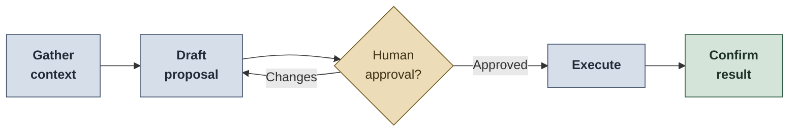

# AI Tools for QA Workflows

Reusable instructions, agents, and skills that configure an AI assistant (GitHub Copilot, Claude Code, or similar) for QA work across the SDLC: requirements review, test strategy, test design, defect reporting, automation support, and reporting.

These are templates. Folder structure, loading behavior, and feature support vary by tool, so check how yours loads instructions before relying on them.

## Files

| File | Purpose |
|---|---|
| `BASICS.instructions.md` | Always-on QA context: role, systems, tools, communication style, safety rules, SDLC principles. Fill in the placeholders with your team context. |
| `BASICS-SHORT.instructions.md` | The short working version: communication style, approval rules, token-efficient tool use. Ready to use with no customization. |
| `agents/manual-qa.agent.md` | Manual QA agent workflow: requirements review, test strategy, test cases, execution, reporting. |
| `agents/qa-assessment.agent.md` | QA consultancy engagement: gather evidence, grade the team, draft a Confluence plan and Jira tickets. |
| `skills/manual-qa/SKILL.md` | Output formats and team standards an assistant cannot infer: test cases, bugs, charters, reports. |
| `skills/qa-assessment/SKILL.md` | The measuring stick: eight scored areas, evidence rules, grade bands, report format. |
| `skills/robot-qa/SKILL.md` | Robot Framework automation guidance. |
| `skills/check-requirements/SKILL.md` | **QA Checker:** is a requirements document complete, testable, and free of contradictions? |
| `skills/check-deliverables/SKILL.md` | **QA Checker:** do QA and development deliverables follow their templates, cover the acceptance criteria, and agree with each other? |
| `skills/check-code/SKILL.md` | **QA Checker:** preliminary trace of developed code against the requirements it was built from. |
| `skills/check-fix/SKILL.md` | **QA Checker:** does a fix address the ticket, fix the cause, and what might it break? |

## Typical prompts

| To | Ask |
|---|---|
| Review a story | "Review this user story for testability and missing acceptance criteria." |
| Plan and design tests | "Create a test strategy and test cases for this feature. Ask for approval before writing anything." |
| Report a defect | "Analyze this defect and draft a bug report with severity, priority, impact, and evidence." |
| Report to leadership | "Create a QA summary report for leadership based on these test results." |
| Grade QA maturity | "Assess this team's QA maturity against the playbook. Repo and Jira available, no interviews. Read-only." |
| Automate | "Review this Robot Framework test for readability, robustness, and maintainability." |
| Check a document | "Check these test cases and the deployment guide against their templates and the ACs in PROJ-812." |
| Check code or a fix | "Check this diff against PROJ-1423. Did it fix the cause, and what should I retest?" |

The four checkers ask for their required inputs and stop if they are missing, rather than guessing. `check-code` and `check-fix` are preliminary and always end with what a human still has to test. The assessment agent reads, grades, and drafts locally; it creates nothing in Confluence or Jira unless you approve that as a separate step.

## CLI vs MCP

Simplest tool that gives the right result. **CLI and local tools** for searching files, reading repository structure, running tests, git status and diffs, small edits, and local logs. **MCP** only when external system context is genuinely required: Jira, Azure DevOps, TestRail, Zephyr, Confluence, GitHub. Never when a local read, grep, or test command answers the question. Full guidance: [BASICS.instructions.md](BASICS.instructions.md#cli-vs-mcp-guidance).

## Safety rules

- Never include secrets, credentials, tokens, private keys, customer data, production data, or proprietary system details in prompts or examples.
- Use synthetic or anonymized test data.
- No AI writes to issue trackers, test management tools, documentation, repositories, or production systems without explicit approval.
- Treat production as read-only unless a formally approved operational process says otherwise.
- Review all generated test cases, bug reports, and automation code before using them.
- Keep AI-generated content traceable to requirements, risks, and evidence.

AI belongs in QA as a productivity layer, not as a replacement for engineering judgment. The assistant should be useful; the QA professional remains accountable for every quality decision.

## Customizing

Replace the placeholders in `BASICS.instructions.md` with your product, architecture, test scope, tools, automation framework, CI/CD, environments, and DoR/DoD. Remove what does not apply, and add your own product risks, test data rules, and internal template links.
